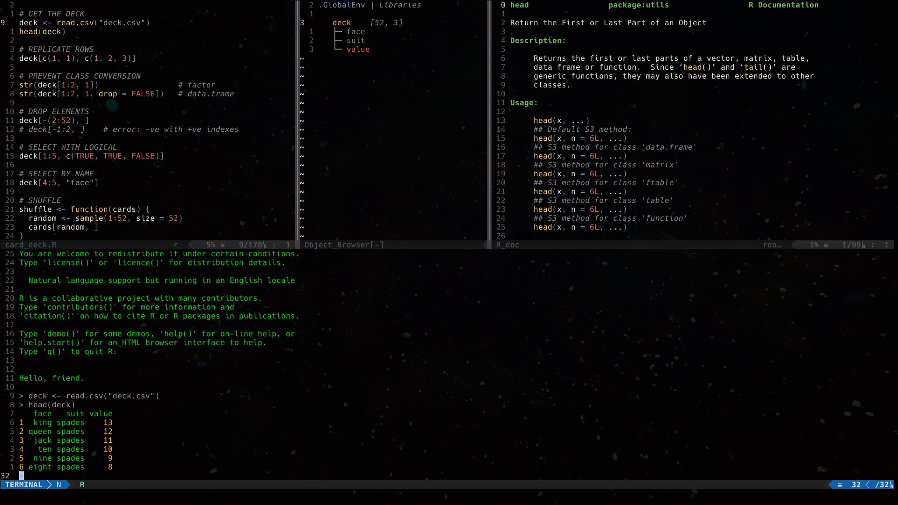
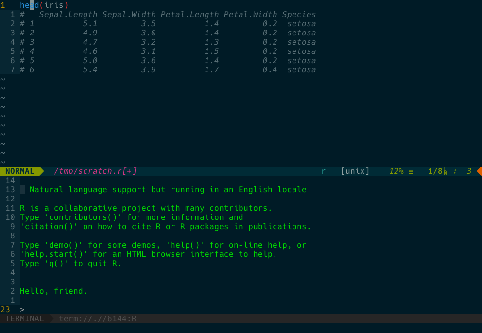
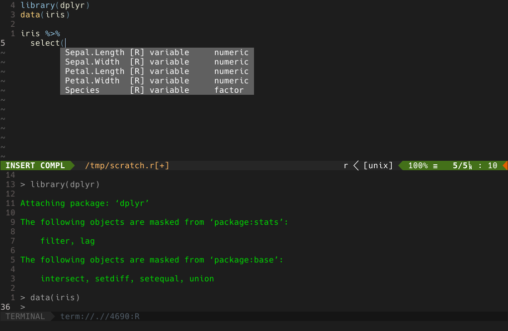
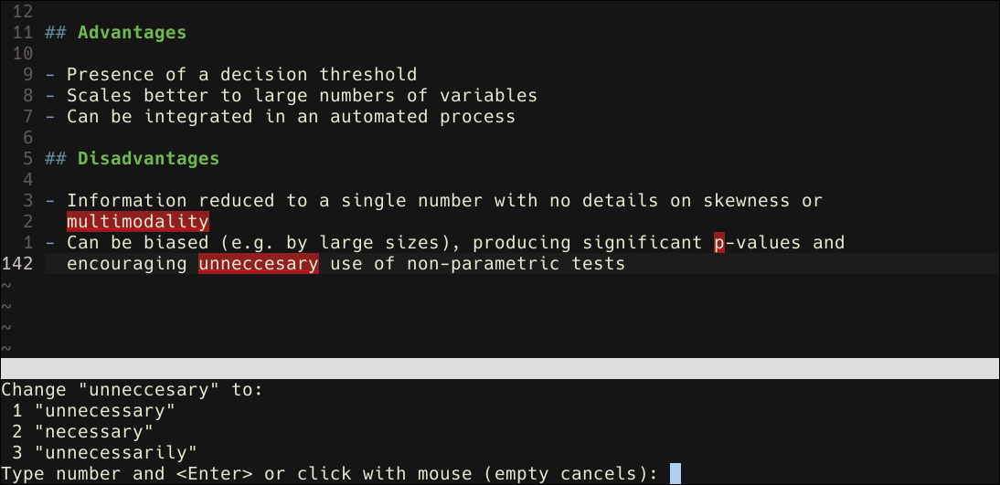
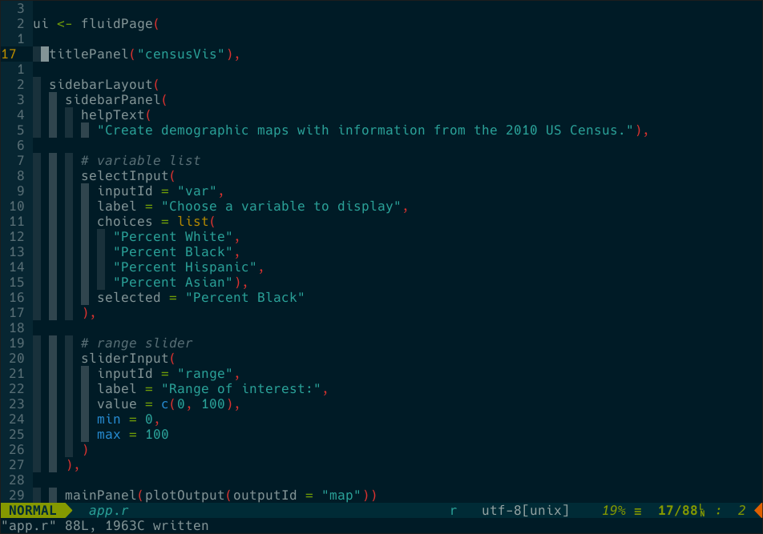

In this document I will describe my IDE-like environment for using R in Vim. Part of my skill set as a programmer and a statistician is my editor workflow, so the main purpose of this document is showcasing that part. You might be curious to see R used outside of RStudio (and "raw" R), or you might actually be interested in trying it yourself. In both cases, this writing will give you a broad idea of what it is like to use Vim.

If you haven't heard about it, Vim is a text editor: a program you'd use to type and, most importantly, edit code. In RStudio, the editor is the top-left pane where you write scripts and R Markdown.

First: points to consider
=========================

-   This environment is by no means an RStudio replacement: RStudio is an IDE, while Vim is a text editor However, it works for my use cases. I also keep adding new things to it constantly. It is like my own piece of software that gets new additions and fixes over time.

-   The content here does not suffice as a tutorial, although it can be informational and give some leads for whoever is interested.

-   RStudio has Vim keybindings. If you were sold on learning Vim but don't want to change from RStudio, I can recommend learning Vim and using its bindings in RStudio. It isn't a bad compromise.

-   I use Neovim as it has a better implementation of a terminal emulator than Vim, but the environment itself (including plug-ins and configuration) is applicable in practically any version of Vim.

Vim itself!
===========

-   One of the selling points for me to try doing my R work inside of Vim is, obviously, Vim! It works *very* differently from conventional editors. But, after the painful introduction period, things started to make sense. Afterwards, I started discovering its huge power in editing text. It also became very easy to edit in once I understood its "language".

-   I won't go into the details of its modal style or how it works. But I will show relatively simple examples that, nonetheless, feel like wizardry.

    1.  Very often I want to delete whatever is inside a pair of parentheses or quotation marks. There is a command to do that which is **di(**, **di)** or **di"**. There are, of course, similar commands for other types of brackets. Actually the basic commands are intuitive, so I didn't really "memorize" those... I only said in my head: **d**elete **i**nside the **(** and bam!

    2.  There is a paragraph with weird line lengths: some are too short, some are exceeding the best practice limit of 80 characters. All I have to do is keep the cursor on any line of that paragraph and press **gqap**. The whole paragraph is joined and separated whenever is appropriate to make all lines at 80 characters max. (I memorize **gq** for formatting and **ap** is short for a paragraph, which can be replaced with other motions.)

-   Generally speaking, I don't use the mouse (at all) when editing with Vim. What is even better is that executing commands require mostly 2-3 keystrokes without a lot of modifier keys like Ctrl and Alt (Sorry not sorry, Emacs...), most frequently near or exactly on home row.

-   Also, since Vim is purely command-line, I get deprived from the GUI features in RStudio like a knit button or creation of a project directory, etc. It would be up to me to dive under the hood and figure out what pieces of code account for those buttons. This could be better or worse for your view, but I appreciate the learning process that goes into that.

Nvim-R: plugin to run R console (and more)
==========================================

-   This plugin is the main reason it is feasible to run an R environment in Vim. Installing this plugin would make me able to open an R console within Vim and send code to it. It also provides very handy shortcuts to access documentation, view environment objects, knit R Markdown, and more.

-   The way the plugin (and Vim) works has an advantage that the layout is not fixed, so I can see what I want only when I need, unlike RStudio where I have the 4-pane layout all the time. (There are ways to show one pane at a time in RStudio but it is tedious; RStudio was not meant to work that way.)

-   An especially great feature is a shortcut to run code and put the output *in the script* as comment lines.

> **Note:** the plugin has a way to make Vim work with RStudio. I haven't experimented with that yet, but I plan to.

Completion
==========

-   Completion is an essential feature for coding efficiency. Vim by default has a completion feature named OmniCompletion. The Nvim-R plugin supports OmniCompletion to complete functions, environment variables, and function arguments. It has two disadvantages: it doesn't suggest variable names after a pipe operator (like RStudio does), and the completion needs to be triggered manually with **Ctrl-X Ctrl-O**.

-   These disadvantages in OmniCompletion can be mitigated by another plugin named Ncm-R, which provides as-you-type kind of completion. It also provides suggestions by fuzzy finding.

-   There is also another built-in completion for file paths which is triggered by **Ctrl-X Ctrl-F**.

-   Admittedly, completion here (the way I use it now) feels slightly less capable than RStudio's completion system because the latter is more context-aware. However, there is a lot about Vim's completion systems that I don't know yet, and I will test it further in the future.

Automatic pair adjustment
=========================

-   RStudio, like most modern IDEs and editors, inserts automatically a closing parenthesis which works with other paired symbols. Also, pressing enter in the middle of a pair automatically adjusts parentheses and their indentation. This behavior can be integrated in Vim with a plugin called pear-tree.

Relative line numbers
=====================

-   Practically all editors have line numbers, but Vim has this very unique feature called relative line numbers. What it does is that, instead of the usual line number, it shows where any line is *relative* to the line on which the cursor currently is. So, if I'm on line 18, the line above it will not be numbered as 17 but 1. This is very useful when working with Vim commands since this will make it easy for you to repeat some command on a specific number of lines which you can do precisely without rough eyeballing.

-   The command for enabling relative line numbers is this:

        :set number relativenumber

-   All screenshots in this document are examples of relative line numbers.

Spell-checking
==============

-   Vim has spell-checking capability that can be useful when writing R Markdown documents. It can be toggled by the command:

        :set spell!

    I mapped a keyboard shortcut for this command to toggle spell-checking on the fly.

-   There are handy shortcuts like **\]s** and **\[s** to navigate to the next and previous misspelled words, respectively, and **z=** to get a list of suggestions for correction.

Header comment
==============

-   This is kind of my own hack to enable this feature which I love in RStudio: inserting a header comment as some text followed by dashed until a line length of 75. I did it by mapping the sequence that would manually make the header into a shortcut:

        nnoremap <localleader>h I#<esc>74a-<esc>0lR<space>

    This basically inserts the pound sign (\#) and dashes and puts me in "replace" mode to plug in my own header text.

-   There could be a better way to do it, but this will suffice for now with my own knowledge in Vim.

Indent Guides
=============

-   Shiny development requires a lot more nesting than data analysis does. So, as soon as I started getting my hands on Shiny, I needed indent guides. Luckily, there is a plugin for that called vim-indent-guides.

Final thoughts
==============

I may or may not succeed eventually in making a work-ready IDE in the long run, but in any case, learning editing in Vim and tweaking it is a very engaging and fun experience to me. I like trying out new pieces of software, especially ones that allow lots of customization and productivity boosting, and Vim gave me that!

> P.S. I also love RStudio. :D
