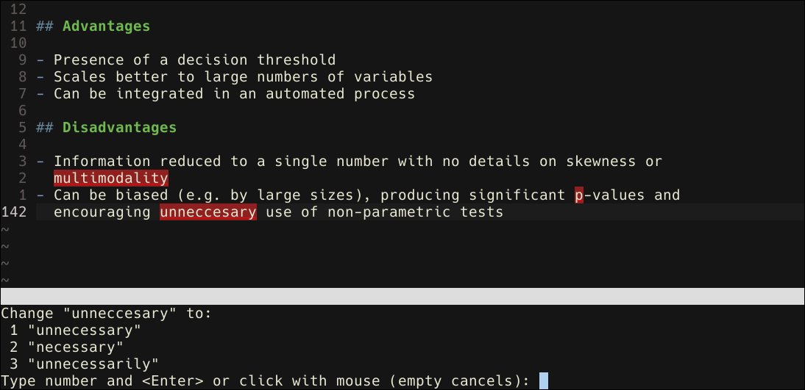

```{r init, echo=FALSE}
knitr::opts_chunk$set(
  echo=FALSE
)
```


In this document I will describe my IDE-like environment for using R in Vim.
Part of my skill set as a programmer and a statistician is my editor workflow,
so the main purpose of this document is showcasing that part. You might be
curious to see R used outside of RStudio (and "raw" R), or you might actually
be interested in trying it yourself. In both cases, this writing will give you
a broad idea of what it is like to use Vim.

If you haven't heard about it, Vim is a text editor: a program you'd use to
type and, most importantly, edit code. In RStudio, the editor is the top-left
pane where you write scripts and R Markdown.

# First: points to consider {-}

- This environment is by no means an RStudio replacement. However, it works for
  my use cases. I also keep adding new things to it constantly. It is like my
  own piece of software that gets new additions and fixes over time.

- The content here does not suffice as a tutorial, although it can be
  informational and give some leads for whoever is interested.

- In fact, RStudio has Vim keybindings. If you were sold on learning Vim but
  don't want to change from RStudio, I can recommend learning Vim and using its
  bindings in RStudio. It isn't a bad compromise.

- I use Neovim as it has a better implementation of a terminal emulator than
  Vim, but the environment itself (including plug-ins and configuration) is
  applicable in practically any version of Vim.

# Vim itself!

- One of the selling points for me to try doing my R work inside of Vim is,
  obviously, Vim! It works _very_ differently from conventional editors. But,
  after the painful introduction period, things started to make sense.
  Afterwards, I started discovering its huge power in editing text. It also
  became very easy to edit in once I understood its "language".

- I won't go into the details of its modal style or how it works. But I will
  show relatively simple examples that, nonetheless, feel like wizardry.

    1. Very often I want to delete whatever is inside a pair of parentheses or
       quotation marks. There is a command to do that which is **di(**, **di)**
       or **di\"**. There are, of course, similar commands for other types of
       brackets. Actually the basic commands are intuitive, so I didn't really
       "memorize" those... I only said in my head: **d**elete **i**nside the
       **(** and bam!

    2. There is a paragraph with weird line lengths: some are too short, some
       are exceeding the best practice limit of 80 characters. All I have to do
       is keep the cursor on any line of that paragraph and press **gqap**. The
       whole paragraph is joined and separated whenever is  appropriate to make
       all lines at 80 characters max. (I memorize **gq** for formatting and
       **ap** is short for a paragraph, which can be replaced with other
       motions.)

- Generally speaking, I don't use the mouse (at all) when editing with Vim.
  What is even better is that executing commands require mostly 2-3 keystrokes
  without a lot of modifier keys (like Ctrl and Alt)^[Sorry not sorry,
  Emacs...], most frequently near or exactly on home row.

- Also, since Vim is purely command-line, I get deprived from the GUI features
  in RStudio like a knit button or creation of a project directory, etc. It
  would be up to me to dive under the hood and figure out what pieces of code
  account for those buttons. This could be better or worse for your view, but I
  appreciate the learning process that goes into that.

# Nvim-R: plugin to run R console (and more)

- This plugin is the main reason it is feasible to run an R environment in Vim.
  Installing this plugin would make me able to open an R console within Vim and
  send code to it. It also provides very handy shortcuts to access
  documentation, view environment objects, knit R Markdown, and more.

- The way the plugin (and Vim) works has an advantage that the layout is not
  fixed, so I can see what I want only when I need, unlike RStudio where I have
  the 4-pane layout all the time.  (There are ways to show one pane at a time
  in RStudio but it is tedious; RStudio was not meant to work that way.)

```{r layout, fig.cap="General layout"}

```

- An especially great feature is a shortcut to run code and put the output _in
  the script_ as comment lines.

```{r out_comment, fig.cap="Printing output as comments in the script"}

```

> **Note:** the plugin has a way to make Vim work with RStudio. I haven't
> experimented with that yet, but I plan to.

# Completion

- Completion is an essential feature for coding efficiency. Vim by default has
  a completion feature named OmniCompletion. The Nvim-R plugin supports
  OmniCompletion to complete functions, environment variables, and function
  arguments. It has two disadvantages: it doesn't suggest variable names after
  a pipe operator (like RStudio does), and the completion needs to be triggered
  manually with **Ctrl-X Ctrl-O**.

- These disadvantages in OmniCompletion can be mitigated by another plugin
  named Ncm-R, which provides as-you-type kind of completion. It also provides
  suggestions by fuzzy finding. 

- There is also another built-in completion for file paths which is triggered
  by **Ctrl-X Ctrl-F**.

- Admittedly, completion here (the way I use it now) feels slightly less
  capable than RStudio's completion system because the latter is more
  context-aware. However, there is a lot about Vim's completion systems that I
  don't know yet, and I will test it further in the future.

```{r compl, fig.cap="Completion"}

```

# Relative line numbers

- Practically all editors have line numbers, but Vim has this very unique
  feature called relative line numbers. What it does is that, instead of the
  usual line number, it shows where any line is _relative_ to the line on which
  the cursor currently is. So, if I'm on line 18, the line above it will not be
  numbered as 17 but 1. This is very useful when working with Vim commands
  since this will make it easy for you to repeat some command on a specific
  number of lines which you can do precisely without rough eyeballing.

- The command for enabling relative line numbers is this:
```
:set number relativenumber
```

- All screenshots in this document are examples of relative line numbers.

# Spell-checking

- Vim has spell-checking capability that can be useful when writing R Markdown
  documents. It can be toggled by the command:
```
:set spell!
```
  I mapped a keyboard shortcut for this command to toggle spell-checking on the
  fly.

- There are handy shortcuts like **]s** and **[s** to navigate to the next and
  previous misspelled words, respectively, and **z=** to get a list of
  suggestions for correction.

```{r spellcheck, fig.cap="Spell checking"}

```

# Header comment

- This is kind of my own hack to enable this feature which I love in RStudio:
  inserting a header comment as some text followed by dashed until a line
  length of 75. I did it by mapping the sequence that would manually make the
  header into a shortcut:
```
nnoremap <localleader>h I#<esc>74a-<esc>0lR<space>
```
  This basically inserts the pound sign (#) and dashes and puts me in "replace"
  mode to plug in my own header text.

- There could be a better way to do it, but this will suffice for now with my
  own knowledge in Vim.

# Indent Guides

- Shiny development requires a lot more nesting than data analysis does. So, as
  soon as I started getting my hands on Shiny, I needed indent guides. Luckily,
  there is a plugin for that called vim-indent-guides.

```{r indent, fig.cap="Indent guides"}

```


# Final thoughts {-}

I may or may not succeed eventually in making a work-ready IDE in the long run,
but in any case, learning editing in Vim and tweaking it is a very engaging and
fun experience to me. I like trying out new pieces of software, especially ones
that allow lots of customization and productivity boosting, and Vim gave me
that!


> P.S. I also love RStudio. :D
